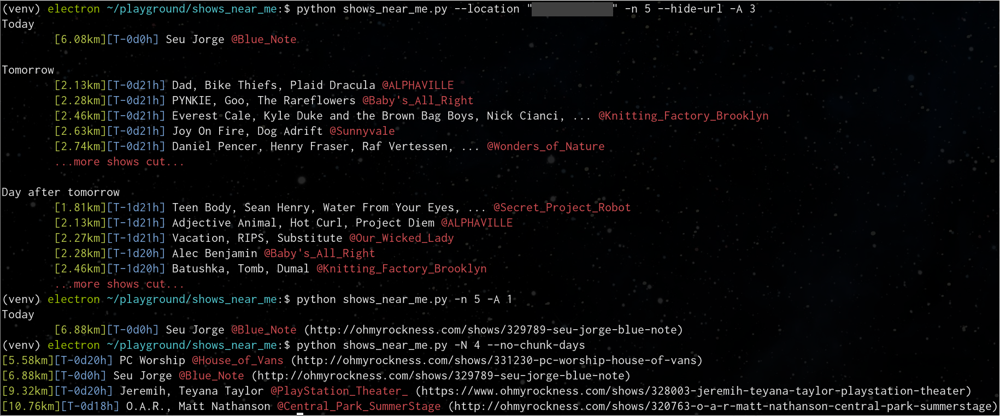

# SHOWS NEAR ME

Want to know what shows are happening near you, but can't get away from your
terminal? Does going to websites with a bunch of "images" and "javascript" and
all that "Web 2.0" stuff not interest you? We've got you covered.

This repo provides a python module and CLI script to poll and display shows from
[ohmyrockness.com](https://ohmyrockness.com).




## CLI

```
$ showsnearme  [-h] [--city {new york,los angeles,chicago}]
              [-N, --n-shows N_SHOWS] [-n, --n-shows-daily N_SHOWS_DAILY]
              [-A, --end-days N_END_DAYS] [-B, --start-days N_START_DAYS]
              [--no-chunk-days] [--show-old] [--hide-url] [--imperial]
              [--debug]
              [location]
Find local shows
positional arguments:
  location              location of search (default: geoip location) (default:
                        None)
optional arguments:
  -h, --help            show this help message and exit
  --city {new york,los angeles,chicago}
                        Which ohmyrockness city to look up (default: new york)
  -N, --n-shows N_SHOWS
                        Number of total shows to show (default: None)
  -n, --n-shows-daily N_SHOWS_DAILY
                        Number of shows per day maximum to show (default:
                        None)
  -A, --end-days N_END_DAYS
                        Number of days from now to end query (default: None)
  -B, --start-days N_START_DAYS
                        Number of days from now to start query (default: 0)
  --no-chunk-days       Don't chunk results into calendar days (default: True)
  --show-old            Show shows that have already started (default: False)
  --hide-url            Whether to hide URLs from output (default: True)
  --imperial            Show distances in miles instead of km (default: False)
  --debug               Debug Output (default: False)
```
